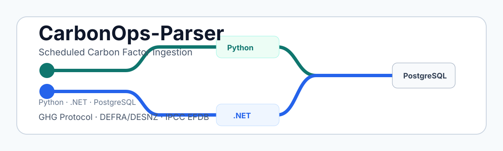

# CarbonOps-Parser



Scheduled carbon factor ingestion and parsing reference project with Python and .NET implementation options.


CarbonOps-Parser is a standalone public technical project for scheduled carbon factor source ingestion and parsing. It checks selected public emission factor sources, detects source version or hash changes, archives raw source files, parses source-specific structures, validates parsed records, and stores ingestion metadata and source-specific records in PostgreSQL.

The project is independent from `carbonops-assistant`. It is not a continuation, module, plugin, or dependency of that project.

## Current Status

CarbonOps-Parser is in early Phase 1. The repository currently emphasizes project documentation, architecture, schema contract notes, source support planning, and public contribution structure before parser implementation begins.

Implementation work is planned for two independent paths:

- Python in `src/python`
- .NET in `src/dotnet`

Users who clone or fork the repository should be able to choose either implementation path.

## Phase 1 Scope

Phase 1 focuses on scheduled ingestion and parsing for:

- GHG Protocol
- DEFRA/DESNZ
- IPCC EFDB

The intended Phase 1 workflow is:

1. Read configuration.
2. Validate the database provider.
3. Connect to PostgreSQL.
4. Check whether required tables exist.
5. Create missing tables if needed.
6. Initialize source schedules.
7. Check source version and file hash.
8. Download a source document when a new version or hash is detected.
9. Archive the raw source file.
10. Parse source-specific structures.
11. Validate parsed records.
12. Persist shared ingestion metadata and source-specific records.
13. Store import summaries and validation issues.

## Architecture At A Glance

```text
source schedule
  -> version/hash check
  -> download when changed
  -> raw file archive
  -> source-specific parser
  -> validation
  -> PostgreSQL persistence
  -> import summary and validation issues
```

Phase 1 uses shared ingestion metadata tables plus source-specific master/detail tables. It does not force GHG Protocol, DEFRA/DESNZ, and IPCC EFDB into one canonical factor table. A normalized or search-oriented projection may be considered in a later phase.

## Implementation Options

### Python

The Python implementation is planned first because it is practical for source discovery, spreadsheet inspection, parser mapping, validation, and data engineering workflows.

The initial Python source adapter contracts and in-memory registry live under `src/carbonfactor_parser/source_adapters`.

See [src/python/README.md](src/python/README.md).

### .NET

The .NET implementation is planned as an independent Worker Service path that follows the same conceptual workflow with .NET-oriented application structure.

See [src/dotnet/README.md](src/dotnet/README.md).

## Install And Local Dry-Run Quickstart

From a fresh checkout or local working copy:

```bash
git clone <REPOSITORY_URL> CarbonOps-Parser
cd CarbonOps-Parser
python -m pip install -e .
```

Run the test suite if you want a quick local smoke check:

```bash
python -m pytest
```

Run the checked-in DEFRA/DESNZ fixture through the local dry-run CLI:

```bash
carbonops-parser local-dry-run \
  --local-path examples/fixtures/defra_desnz_minimal.csv \
  --source-family defra_desnz \
  --source-id defra-desnz-minimal-fixture \
  --content-type text/csv \
  --format-hint csv
```

Expected summary:

```text
status=success
parsed_record_count=2
normalization_record_count=2
persistence_input_record_count=2
ddl_preview_present=True
issue_count=0
```

Run the JSON variant:

```bash
carbonops-parser local-dry-run \
  --local-path examples/fixtures/defra_desnz_minimal.csv \
  --source-family defra_desnz \
  --source-id defra-desnz-minimal-fixture \
  --content-type text/csv \
  --format-hint csv \
  --output-format json
```

Key output fields:

- `status`: dry-run outcome such as `success`, `failed`, `unsupported`, or `no_records`
- `parsed_record_count`: records parsed by the minimal local DEFRA/DESNZ fixture parser
- `normalization_record_count`: records produced by the minimal fixture normalization mapper
- `persistence_input_record_count`: records prepared as `PersistenceInput`
- `ddl_preview_present`: whether review-only PostgreSQL DDL preview text is attached
- `issues`: structured local loader, parser, normalization, or persistence-input issues

This quickstart is local dry-run only. It does not connect to PostgreSQL, write records, execute SQL, run migrations, perform network calls, trigger source acquisition, load config files, or require credentials. It does not make production DEFRA/DESNZ correctness claims.

For boundary details, see [Local Dry-Run CLI Boundary](docs/local-dry-run-cli-boundary.md), [Local File Normalized Persistence Dry-Run Boundary](docs/local-file-normalized-persistence-dry-run-boundary.md), and [Local Dry-Run Troubleshooting](docs/local-dry-run-troubleshooting.md).

## Developer Tests

Run the lightweight Python test suite from the repository root:

```bash
python -m pytest
```

Pytest configuration is kept in [pyproject.toml](pyproject.toml), including the `src` package import path used by the tests.

## Public API Examples

The `carbonfactor_parser.source_adapters` package exposes source adapter contracts and lightweight helpers for tests, prototypes, and implementation slices.

Hash source content without reading or downloading files:

```python
from carbonfactor_parser.source_adapters import (
    sha256_hex_from_bytes,
    sha256_hex_from_text,
)

content_hash = sha256_hex_from_bytes(b"sample source content")
note_hash = sha256_hex_from_text("sample metadata note")
```

Create and validate metadata for an existing local file:

```python
from pathlib import Path

from carbonfactor_parser.source_adapters import (
    SourceFamily,
    build_source_document_from_file,
    validate_source_document_metadata,
)

document = build_source_document_from_file(
    source_family=SourceFamily.DEFRA_DESNZ,
    source_name="Example local factor file",
    file_path=Path("data/raw/example/source.csv"),
)

metadata_issues = validate_source_document_metadata(document)
```

Create and validate an ingestion summary contract:

```python
from carbonfactor_parser.source_adapters import (
    SourceFamily,
    create_ingestion_run_summary,
    validate_ingestion_run_summary,
)

summary = create_ingestion_run_summary(
    ingestion_id="example-run-001",
    source_family=SourceFamily.DEFRA_DESNZ,
    source_name="Example local factor file",
)

summary_issues = validate_ingestion_run_summary(summary)
```

Use the artificial-only source acquisition validation pipeline with in-memory metadata:

```python
from carbonfactor_parser import (
    create_artificial_source_acquisition_metadata,
    validate_and_summarize_artificial_source_acquisition_metadata,
)

metadata = create_artificial_source_acquisition_metadata(
    source_family="artificial_source_acquisition",
    logical_source_name="artificial-in-memory-source",
    declared_content_type="text/csv",
    checksum_sha256="a" * 64,
    acquired_at_label="static-artificial-acquisition-label",
)

pipeline_result = validate_and_summarize_artificial_source_acquisition_metadata(
    metadata,
)
issue_count = pipeline_result.summary.total_issue_count
```

This pipeline is limited to artificial metadata shape checks and deterministic summaries. It does not acquire real sources, read files, validate real source URLs, run parsers or normalization, check factor correctness, or provide compliance/legal or carbon accounting correctness. See [docs/artificial-source-acquisition-validation-pipeline.md](docs/artificial-source-acquisition-validation-pipeline.md), [docs/artificial-source-acquisition-module-recap.md](docs/artificial-source-acquisition-module-recap.md), and [examples/example_artificial_source_acquisition_validation_pipeline.py](examples/example_artificial_source_acquisition_validation_pipeline.py).

## Source acquisition CLI quickstart

Use the `carbonops-source-acquisition` CLI for local source descriptor checks and acquisition flow previews.

- Default `run` mode is `noop` and offline.
- HTTP mode is opt-in with `--client http`.
- `validate` checks local descriptor metadata only; it does not verify live URLs.
- `run --dry-run` plans targets only and does not acquire content or write files/manifests.
- Parser execution and database persistence are outside this CLI boundary at this phase.

```bash
carbonops-source-acquisition validate
carbonops-source-acquisition list
carbonops-source-acquisition list --source-id defra_desnz
carbonops-source-acquisition run --dry-run --base-directory ./data/source-acquisition
carbonops-source-acquisition run --output-format json
carbonops-source-acquisition run --client http --source-id ghg_protocol
carbonops-source-acquisition run --client http --source-id ghg_protocol --persist-content --base-directory ./data/source-acquisition
```

For boundary details, see:

- [Source Acquisition CLI Boundary](docs/source-acquisition-cli-boundary.md)
- [Source Acquisition Registry](docs/source-acquisition-registry.md)
- [Source Acquisition HTTP Client Boundary](docs/source-acquisition-http-client-boundary.md)
- [Source Acquisition Parser Handoff Contract](docs/source-acquisition-parser-handoff-contract.md)

See [examples/example_acquisition_artifact_parser_input_mapping.py](examples/example_acquisition_artifact_parser_input_mapping.py) for a deterministic in-memory example of mapping acquisition artifact metadata into a future parser input boundary without executing a parser.

The parser package exposes `ParserInputContract`, `create_parser_input_contract()`, `validate_parser_input_contract()`, `ParserFileContentInput`, local parser file content loading helpers, parser file content validation helpers, `parse_defra_desnz_file_content()`, raw parsed record payload contracts, the `ParserAdapter` protocol, `NoopParserAdapter`, `ArtificialParserAdapter`, `DefraDesnzParserAdapter`, parser adapter registry helpers, parser execution planning and runner helpers, and parser execution result contracts for future parser adapter input handoff. The normalization package exposes parser execution handoff helpers, normalization input helpers for successful parser results with raw payloads, and a minimal DEFRA/DESNZ fixture normalization mapper. The persistence package exposes normalized result persistence input contracts, a logical PostgreSQL schema descriptor, a review-only DDL preview helper, repository protocol/result contracts, an explicit caller-provided PostgreSQL options contract, a default-disabled PostgreSQL integration test boundary, and a PostgreSQL repository skeleton that returns unsupported results without database runtime behavior. The pipeline package exposes a local DEFRA/DESNZ fixture dry-run helper that composes those boundaries to produce `PersistenceInput` plus DDL preview metadata without DB or network behavior. These contracts keep acquisition metadata, already-loaded content, raw parser output, parser output metadata, normalization input, normalization handoff metadata, persistence input metadata, schema metadata, repository options metadata, integration test metadata, and repository result metadata separate; they do not include database connection behavior or full source-specific correctness claims.

## Source Support

Each Phase 1 source family will have its own schedule, source version/hash check, parser, validation rules, archive layout, and source-specific tables.

| Source family | Phase 1 role | Table group |
| --- | --- | --- |
| GHG Protocol | Source-specific parser and workbook/tool mapping | `ghg_*` |
| DEFRA/DESNZ | First planned ingestion slice after discovery | `defra_*` |
| IPCC EFDB | Heterogeneous source discovery and parser mapping | `ipcc_*` |

See [docs/source-support.md](docs/source-support.md) and [docs/source-discovery.md](docs/source-discovery.md).

## Configuration Summary

The conceptual configuration model includes:

- Database provider and connection settings.
- Raw archive path.
- Source-specific enabled flags.
- Source-specific schedules with day, week, month, time, and timezone support.

Phase 1 implements only `postgres` as the database provider. `mysql` and `mssql` are recognized as conceptual provider names but are not implemented in Phase 1.

See [docs/configuration-model.md](docs/configuration-model.md).

The shared conceptual example lives at [config/carbonops.config.example.yaml](config/carbonops.config.example.yaml).

## Database Model Summary

PostgreSQL is the Phase 1 persistence target. The model includes:

- Shared ingestion metadata tables: `carbon_sources`, `carbon_source_versions`, `carbon_import_runs`, `carbon_raw_files`, `carbon_validation_issues`, and `carbon_job_locks`.
- DEFRA/DESNZ tables: `defra_categories`, `defra_subcategories`, `defra_factor_sets`, and `defra_factor_values`.
- GHG Protocol tables: `ghg_tools`, `ghg_factor_sheets`, `ghg_factor_groups`, and `ghg_factor_values`.
- IPCC EFDB tables: `ipcc_sectors`, `ipcc_categories`, `ipcc_references`, `ipcc_factor_records`, and `ipcc_factor_values`.

See [docs/database-model.md](docs/database-model.md), [docs/database-startup.md](docs/database-startup.md), and [database/postgres/README.md](database/postgres/README.md).

## Documentation Map

- [Architecture](docs/architecture.md)
- [Configuration Model](docs/configuration-model.md)
- [Configuration Example](config/carbonops.config.example.yaml)
- [Background Job Model](docs/background-job-model.md)
- [Database Model](docs/database-model.md)
- [Database Startup](docs/database-startup.md)
- [Ingestion Metadata Model](docs/ingestion-metadata-model.md)
- [Codex-Assisted Runs](docs/codex-runs/README.md)
- [Engineering Standards](docs/engineering-standards.md)
- [Linux Service Setup](docs/linux-service-setup.md)
- [Source Support](docs/source-support.md)
- [Source Discovery](docs/source-discovery.md)
- [Source Ingestion Boundaries](docs/source-ingestion-boundaries.md)
- [Source Acquisition Boundary](docs/source-acquisition-boundary.md)
- [Source Acquisition CLI Boundary](docs/source-acquisition-cli-boundary.md)
- [Source Acquisition Sequencing Checklist](docs/source-acquisition-sequencing-checklist.md)
- [Local Source Acquisition Contract Boundary](docs/local-source-acquisition-contract-boundary.md)
- [Local Source Acquisition Examples Boundary](docs/local-source-acquisition-examples-boundary.md)
- [Local Source Manifest Boundary](docs/local-source-manifest-boundary.md)
- [Local Source Manifest Examples Boundary](docs/local-source-manifest-examples-boundary.md)
- [Source Manifest Adapter Handoff Boundary](docs/source-manifest-adapter-handoff-boundary.md)
- [Source Manifest Adapter Handoff Examples Boundary](docs/source-manifest-adapter-handoff-examples-boundary.md)
- [Source Acquisition Validation Boundary](docs/source-acquisition-validation-boundary.md)
- [Source Acquisition Validation Examples Boundary](docs/source-acquisition-validation-examples-boundary.md)
- [Source Acquisition Error Taxonomy Boundary](docs/source-acquisition-error-taxonomy-boundary.md)
- [Source Acquisition Error Taxonomy Examples Boundary](docs/source-acquisition-error-taxonomy-examples-boundary.md)
- [Source Acquisition Review Gate Boundary](docs/source-acquisition-review-gate-boundary.md)
- [Source Acquisition Review Gate Examples Boundary](docs/source-acquisition-review-gate-examples-boundary.md)
- [Source Acquisition Implementation Readiness Boundary](docs/source-acquisition-implementation-readiness-boundary.md)
- [Source Acquisition Implementation Readiness Examples Boundary](docs/source-acquisition-implementation-readiness-examples-boundary.md)
- [Source Acquisition Implementation Sequencing Checklist](docs/source-acquisition-implementation-sequencing-checklist.md)
- [Source Acquisition Implementation Sequencing Examples Boundary](docs/source-acquisition-implementation-sequencing-examples-boundary.md)
- [Source Acquisition Parser Handoff Contract](docs/source-acquisition-parser-handoff-contract.md)
- [Artificial Source Acquisition Validation Pipeline](docs/artificial-source-acquisition-validation-pipeline.md)
- [Artificial Source Acquisition Module Recap](docs/artificial-source-acquisition-module-recap.md)
- [Artificial Source Acquisition Phase Closure](docs/artificial-source-acquisition-phase-closure.md)
- [Artificial Manifest Metadata Boundaries](docs/artificial-manifest-metadata-boundaries.md)
- [Artificial Manifest Validation Summary](docs/artificial-manifest-validation-summary.md)
- [Artificial Manifest Metadata Collection](docs/artificial-manifest-metadata-collection.md)
- [Artificial Manifest Collection Validation Summary](docs/artificial-manifest-collection-validation-summary.md)
- [Artificial Manifest Metadata Phase Recap](docs/artificial-manifest-metadata-phase-recap.md)
- [Artificial Manifest Next Phase Option Matrix](docs/artificial-manifest-next-phase-option-matrix.md)
- [Artificial In-Memory Manifest Usage Example](docs/artificial-in-memory-manifest-usage-example.md)
- [Artificial Manifest Usage Example Phase Recap](docs/artificial-manifest-usage-example-phase-recap.md)
- [Source Adapter Contract](docs/source-adapter-contract.md)
- [Source Adapter Execution Flow](docs/source-adapter-execution-flow.md)
- [Source Adapter Error And Warning Handling](docs/source-adapter-error-warning-handling.md)
- [Source Adapter Configuration Boundaries](docs/source-adapter-configuration-boundaries.md)
- [Source-Specific Adapter Skeleton Guidance](docs/source-specific-adapter-skeleton-guidance.md)
- [DEFRA/DESNZ Adapter Skeleton Boundaries](docs/defra-desnz-adapter-skeleton-boundaries.md)
- [Parser Adapter Boundary](docs/parser-adapter-boundary.md)
- [Parser Execution Planning Boundary](docs/parser-execution-planning-boundary.md)
- [Parser Execution Result Boundary](docs/parser-execution-result-boundary.md)
- [Parser Execution Runner Boundary](docs/parser-execution-runner-boundary.md)
- [Source-Specific Parser Adapter Boundary](docs/source-specific-parser-adapter-boundary.md)
- [Parser File Content Input Boundary](docs/parser-file-content-input-boundary.md)
- [Local Parser File Content Loader Boundary](docs/local-parser-file-content-loader-boundary.md)
- [Parser Execution Normalization Handoff Boundary](docs/parser-execution-normalization-handoff-boundary.md)
- [Parsed Raw Record Payload Boundary](docs/parsed-raw-record-payload-boundary.md)
- [Parser Handoff Boundary](docs/parser-handoff-boundary.md)
- [Parser Contract Boundaries](docs/parser-contract-boundaries.md)
- [Source-Specific Parser Skeleton Boundaries](docs/source-specific-parser-skeleton-boundaries.md)
- [DEFRA/DESNZ Parser Skeleton Boundaries](docs/defra-desnz-parser-skeleton-boundaries.md)
- [Real Format Parser Boundary](docs/real-format-parser-boundary.md)
- [Normalization Boundary](docs/normalization-boundary.md)
- [Normalization Input Boundary](docs/normalization-input-boundary.md)
- [DEFRA/DESNZ Minimal Normalization Mapping Boundary](docs/defra-desnz-minimal-normalization-mapping-boundary.md)
- [Local File Normalized Persistence Dry-Run Boundary](docs/local-file-normalized-persistence-dry-run-boundary.md)
- [Local Dry-Run CLI Boundary](docs/local-dry-run-cli-boundary.md)
- [Local Dry-Run Troubleshooting](docs/local-dry-run-troubleshooting.md)
- [Normalized Result Persistence Boundary](docs/normalized-result-persistence-boundary.md)
- [PostgreSQL Persistence Schema Boundary](docs/postgresql-persistence-schema-boundary.md)
- [PostgreSQL DDL Preview Boundary](docs/postgresql-ddl-preview-boundary.md)
- [Persistence Repository Boundary](docs/persistence-repository-boundary.md)
- [PostgreSQL Implementation Safety Gate](docs/postgresql-implementation-safety-gate.md)
- [PostgreSQL Integration Test Boundary](docs/postgresql-integration-test-boundary.md)
- [PostgreSQL Config Contract Boundary](docs/postgresql-config-contract-boundary.md)
- [PostgreSQL Repository Skeleton Boundary](docs/postgresql-repository-skeleton-boundary.md)
- [PostgreSQL Repository Implementation Planning Boundary](docs/postgresql-repository-implementation-planning-boundary.md)
- [Parser To Normalization Handoff Boundary](docs/parser-to-normalization-handoff-boundary.md)
- [Parser To Normalization Integration Recap](docs/parser-to-normalization-integration-recap.md)
- [Source To Normalization Pipeline Recap](docs/source-to-normalization-pipeline-recap.md)
- [Normalization Execution Boundary](docs/normalization-execution-boundary.md)
- [Normalization Result Summary Boundary](docs/normalization-result-summary-boundary.md)
- [Normalization Summary Builder Boundary](docs/normalization-summary-builder-boundary.md)
- [Normalization Pipeline Recap](docs/normalization-pipeline-recap.md)
- [Normalization Public API Recap](docs/normalization-public-api-recap.md)
- [Normalization Test Coverage Recap](docs/normalization-test-coverage-recap.md)
- [Normalization Deferred Implementation Roadmap](docs/normalization-deferred-implementation-roadmap.md)
- [Public Roadmap Checkpoint](docs/public-roadmap-checkpoint.md)
- [Milestone Checkpoint CO-037 To CO-049](docs/milestone-checkpoint-co-037-to-co-049.md)
- [Governance Smoke Test Checkpoint](docs/governance-smoke-test-checkpoint.md)
- [Stabilization Checkpoint](docs/stabilization-checkpoint.md)
- [Production Readiness Gap Analysis](docs/production-readiness-gap-analysis.md)
- [Production Readiness Sequencing Roadmap](docs/production-readiness-sequencing-roadmap.md)
- [Repository Navigation Guide](docs/repository-navigation-guide.md)
- [Review Readiness Checklist](docs/review-readiness-checklist.md)
- [Documentation Map Consistency Checklist](docs/documentation-map-consistency-checklist.md)
- [Source Adapter Package Recap](docs/source-adapter-package-recap.md)
- [Roadmap](docs/roadmap.md)
- [Task Breakdown](docs/task-breakdown.md)
- [Limitations](docs/limitations.md)
- [Public Safety](docs/public-safety.md)
- [PostgreSQL Database Notes](database/postgres/README.md)

## Roadmap Summary

Near-term work moves from documentation polish to schema scripts, Python source discovery, PostgreSQL startup checks, raw archive handling, and the first DEFRA/DESNZ ingestion slice. The .NET Worker Service path follows as an independent implementation option.

See [docs/roadmap.md](docs/roadmap.md) and [docs/task-breakdown.md](docs/task-breakdown.md).

## Governance

- [Code of Conduct](CODE_OF_CONDUCT.md)
- [Contributing](CONTRIBUTING.md)
- [Security](SECURITY.md)
- [Support](SUPPORT.md)
- [Issue templates](.github/ISSUE_TEMPLATE)
- [Pull request template](.github/pull_request_template.md)
- [CI placeholder](.github/workflows/README.md)

Issues and pull requests are welcome for documentation, examples, parser mappings, source discovery, database schema notes, and implementation improvements.

## Non-Goals

CarbonOps-Parser does not:

- Calculate carbon inventories.
- Produce emissions reports.
- Replace source-owner documentation or source files.
- Guarantee source data correctness.
- Provide a deployment platform.
- Normalize all source families into one shared factor table during Phase 1.

## License

CarbonOps-Parser is licensed under the [Apache License 2.0](LICENSE).
