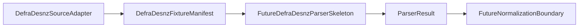

# DEFRA/DESNZ Parser Skeleton Boundaries

DEFRA/DESNZ parser skeleton boundaries exist because DEFRA/DESNZ naming can be useful for future parser organization, but it must not be confused with real parser behavior.

## Purpose

No DEFRA/DESNZ parser exists yet.

Current DEFRA/DESNZ work is limited to local fixture discovery and artificial fixture manifest metadata. A future DEFRA/DESNZ parser skeleton should be added only after source discovery, manifest, parser contract, and source-specific parser skeleton boundaries remain clear.

## What A Future Skeleton May Do

A future DEFRA/DESNZ parser skeleton may:

- Accept source-agnostic parser inputs or pre-supplied artificial records.
- Return `ParserResult`.
- Attach `ParserIssue` warnings or errors.
- Label itself as DEFRA/DESNZ-related when needed.
- Remain deterministic in tests.
- Use artificial fixtures only until real parsing is explicitly scoped.

## Default Non-Responsibilities

A DEFRA/DESNZ parser skeleton must not add by default:

- Real file parsing.
- Real DEFRA/DESNZ format assumptions.
- Real factor values.
- Source-owner data validation.
- Normalization.
- Persistence.
- Scheduler or retry behavior.
- Downloading or remote access.
- Compliance, legal, or correctness determination.

## Relationship To Existing Components

`DefraDesnzSourceAdapter` discovers artificial local fixtures only. It emits `SourceDocument` references and does not inspect fixture contents.

`DefraDesnzFixtureManifest` describes discovered artificial fixture documents only. It is fixture metadata, not parser output.

`ParserResult` is source-agnostic. It can carry records, parser issues, and summary counts without defining source-specific parsing rules.

`ExampleSourceSpecificParser` demonstrates source-family-labelled parser shape, but it is artificial and not DEFRA/DESNZ-specific.

`DefraDesnzParser` is the current DEFRA/DESNZ-labelled artificial parser skeleton. It accepts caller-supplied artificial records and returns `ParserResult` without reading files or applying DEFRA/DESNZ format rules.

## Fixture Policy

DEFRA/DESNZ parser skeleton fixtures must remain tiny and artificial.

Fixtures must not include source-owner data, real emission factor values, or official-looking tables copied from external sources.

Fixture names may use `defra_desnz_` prefixes only for identity and filtering tests.

## Review Checklist

Future DEFRA/DESNZ parser skeleton PRs should confirm:

- No file reads are added unless explicitly scoped.
- No real source URLs are added.
- No real source data is added.
- No format assumptions are added.
- No normalization or persistence behavior is introduced.
- The local public safety script passes.
- Tests are deterministic.
- Parser output remains `ParserResult`.

## Future Task Sequencing

Conservative sequencing should be:

1. DEFRA/DESNZ artificial parser skeleton.
2. DEFRA/DESNZ artificial parser usage example.
3. Real format boundary documentation.
4. Fixture-only parser input mapping.
5. Real parser implementation only after explicit scope.

Each step should remain separate from downloading, normalization, persistence, scheduling, retry behavior, and runtime orchestration.

## Flow Diagram

