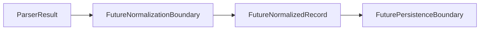

# Normalization Boundary

Normalization needs a separate boundary because parser output is not normalized output.

## Purpose

Parser output describes records and parser-level issues. It does not standardize fields, convert units, approve values, or prepare data for storage.

Normalization contracts and implementation should be added only in later explicit tasks. This document records the intended boundary before that work begins.

`NormalizationIssue`, `NormalizationIssueSeverity`, `NormalizedRecord`, `NormalizationResultSummary`, and `NormalizationResult` now provide a minimal source-agnostic normalization contract skeleton. They do not execute normalization, convert units, or write records.

See `examples/normalization_contract_example.py` for an in-memory normalization contract usage example.

See [Parser To Normalization Handoff Boundary](parser-to-normalization-handoff-boundary.md) before adding code that maps parser output into normalization result shapes.

The current parser-to-normalization handoff model records parser output metadata for future normalization input without executing normalization.

## What Parser Output Represents

`ParserResult` contains parsed or artificial records plus parser-level issues.

`ParserResult` does not certify units, factor values, categories, source labels, or accounting correctness.

Parser warnings and errors are parser-level only. They describe parsing or parser-shaped handoff concerns, not normalized record quality or downstream acceptance.

## Future Normalization Scope

Future normalization work may later:

- Map parser records into normalized records.
- Standardize field names.
- Validate required normalized fields.
- Represent unit labels or factor metadata.
- Produce normalization-level issues.
- Remain separate from persistence, scheduling, and compliance interpretation.

## What Normalization Must Not Imply

Normalization must not imply:

- Legal or compliance interpretation.
- Carbon accounting correctness determination.
- Source-owner data validation.
- Database writes.
- Scheduler or retry behavior.
- Remote source download.
- Automatic acceptance of parsed values as correct.

## Boundary Table

| Layer | Responsibility | Out of scope |
| --- | --- | --- |
| Parser | Produce `ParserResult` records and parser-level issues | Normalized records, unit conversion, persistence |
| Normalization | Future mapping from parser records into explicit normalized shapes | Legal interpretation, runtime scheduling, source discovery |
| Validation | Future checks for required normalized fields or handoff structure | Official-data validation or accounting correctness determination |
| Persistence | Future storage writes behind a separate boundary | Parser execution and normalization rules |
| Scheduler/runtime | Future timed or operational execution | Parser output interpretation and normalized value rules |
| Compliance/legal interpretation | Outside this package boundary | Parser, normalization, validation, and persistence behavior |

## DEFRA/DESNZ Implications

`DefraDesnzParser` is currently artificial and in-memory only.

No real DEFRA/DESNZ normalization exists.

No real factor values are normalized in the current repository.

Future real normalization requires separate explicit scope and should remain separate from parser, persistence, scheduler, and remote source work.

## Review Checklist

Future normalization PRs should confirm:

- No unit conversion is added unless explicitly scoped.
- No correctness or compliance claims are made.
- No persistence coupling is introduced.
- No scheduler coupling is introduced.
- No real source data is added unless explicitly scoped.
- The local public safety script passes.
- Tests remain deterministic when code is added.

## Future Task Sequencing

Conservative sequencing should be:

1. Normalization boundary documentation.
2. Normalization contract skeleton.
3. Artificial normalization example.
4. Parser-to-normalization handoff example.
5. Persistence boundary documentation.
6. Real normalization only after explicit scope.

Each step should remain small, local, and separately reviewable.

## Flow Diagram

