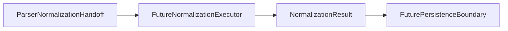

# Normalization Execution Boundary

Normalization execution needs a separate boundary because contracts and handoff models do not execute normalization.

## Purpose

Normalization contracts and parser-to-normalization handoff models exist. No normalization execution exists yet.

Future normalization execution should be added only in later explicit tasks. This document defines the boundary before any executor classes or functions are introduced.

`ArtificialNormalizationExecutor` now provides a small boundary skeleton that maps `ParserNormalizationHandoff` entries into artificial `NormalizedRecord` objects. It is not real normalization logic.

See `examples/example_artificial_normalization_executor_usage.py` for a deterministic in-memory usage example of the artificial executor boundary.

## Future Normalization Execution Scope

Future normalization execution may later:

- Accept `ParserNormalizationHandoff` or generic artificial input.
- Create `NormalizedRecord` objects.
- Produce `NormalizationResult`.
- Attach `NormalizationIssue` warnings or errors.
- Perform deterministic artificial mapping in early tasks.
- Remain separate from persistence, scheduling, and compliance interpretation.

## Default Non-Responsibilities

Normalization execution must not do by default:

- Unit conversion unless explicitly scoped.
- Factor correctness validation.
- Carbon accounting correctness decisions.
- Database writes.
- Scheduler or retry behavior.
- Source downloading.
- Legal or compliance interpretation.
- Automatic acceptance of parser output as correct.

## Artificial And Real Normalization

Early normalization executors should use artificial or generic fields.

Real source-specific normalization requires explicit scope.

Real factor values and unit conversions require separate review.

The local public safety validation script must pass before review.

## Responsibility Table

| Layer | Responsibility | Out of scope |
| --- | --- | --- |
| Parser | Produce `ParserResult` records and parser-level issues | Normalized records and unit conversion |
| Parser-to-normalization handoff | Preserve parser output metadata for future normalization input | Normalization execution and correctness decisions |
| Normalization execution | Future explicit creation of `NormalizedRecord` objects and `NormalizationResult` | Persistence, scheduling, source downloading |
| Normalization validation | Future checks for normalized record shape or required fields | Source-owner validation or compliance interpretation |
| Persistence | Future storage writes behind a separate boundary | Parser, handoff, and normalization execution |
| Scheduler/runtime | Future timed or operational execution | Record interpretation and normalization rules |
| Compliance/legal interpretation | Outside this package boundary | Parser, handoff, normalization, validation, and persistence behavior |

## DEFRA/DESNZ Implications

No real DEFRA/DESNZ normalization exists.

`DefraDesnzParser` is currently artificial and in-memory only.

No real factor values are normalized in the current repository.

Future DEFRA/DESNZ normalization requires separate explicit scope and should remain separate from parser execution, persistence, scheduler, and remote source work.

## Review Checklist

Future normalization execution PRs should confirm:

- No unit conversion is added unless explicitly scoped.
- No correctness or compliance claims are made.
- No persistence coupling is introduced.
- No scheduler coupling is introduced.
- No real source data is added unless explicitly scoped.
- The local public safety script passes.
- Tests remain deterministic when code is added.

The artificial executor skeleton intentionally defers:

- Unit conversion.
- Factor correctness validation.
- Carbon accounting correctness decisions.
- Compliance or legal interpretation.
- Real source data.
- File reading.
- Parser behavior changes.
- Database or persistence behavior.
- Scheduler behavior.
- Retry or cancel behavior.
- Downloading or remote access.
- Config loading.

The usage example is also only a boundary example. It does not change deferred items or add real normalization behavior.

## Future Task Sequencing

Conservative sequencing should be:

1. Normalization execution boundary documentation.
2. Artificial normalization executor skeleton.
3. Artificial normalization executor usage example.
4. Parser-to-normalization-to-normalization-result pipeline example.
5. Persistence boundary documentation.
6. Real source normalization only after explicit scope.

Each step should remain small, local, and separately reviewable.

## Flow Diagram

