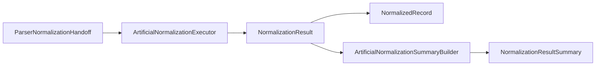

# Normalization Pipeline Recap

This recap explains how the current artificial normalization artifacts fit together. It is a documentation-only overview of the small in-memory sequence added across recent tasks.

## Purpose

The normalization pipeline now has enough artificial contracts, skeletons, and examples to benefit from a compact map.

This document summarizes the current flow from parser handoff metadata through artificial normalization output and output-shape summarization. It does not add implementation code, examples, tests, or runtime behavior.

## Current Artifacts

The current normalization sequence includes:

- `ParserNormalizationHandoff`: carries already-computed parser output metadata toward the normalization boundary.
- `ArtificialNormalizationExecutor`: creates deterministic artificial normalization output from handoff entries.
- `NormalizationResult`: carries normalization records and normalization-level issues.
- `NormalizedRecord`: represents source-agnostic normalized record shape for artificial examples and future contracts.
- `NormalizationResultSummary`: represents output-shape summary fields such as record and issue counts.
- `ArtificialNormalizationSummaryBuilder`: converts an existing `NormalizationResult` into `NormalizationResultSummary` using output-shape counting only.

Related examples remain artificial, deterministic, local, and in-memory.

## Current Artificial Flow

At a high level:

1. Parser handoff enters the normalization boundary as `ParserNormalizationHandoff`.
2. `ArtificialNormalizationExecutor` creates deterministic artificial `NormalizedRecord` entries.
3. The executor returns `NormalizationResult`.
4. `NormalizationResultSummary` can represent output-shape summary values directly.
5. `ArtificialNormalizationSummaryBuilder` can convert `NormalizationResult` into `NormalizationResultSummary` by counting records and issues only.

The flow demonstrates boundaries and contract shape. It does not inspect real source files, convert units, judge factor meaning, or write records anywhere.

## What This Recap Does Not Claim

This recap does not claim that the normalization pipeline is complete or ready for real source processing.

It does not claim legal, compliance, source-owner, or carbon accounting correctness.

It does not claim that parser output is automatically acceptable as normalized output.

It only describes how the current artificial pieces connect.

## Non-Goals

This recap does not introduce:

- New contracts.
- New examples.
- New tests.
- Real normalization execution.
- Unit conversion.
- Factor correctness validation.
- Parser behavior changes.
- Persistence behavior.
- Scheduler or retry behavior.
- Remote source access or downloading.
- Config loading.

## Deferred Items

The normalization pipeline recap intentionally defers:

- Real normalization correctness.
- Executor integration beyond current artificial skeleton behavior.
- Aggregation semantics beyond output-shape counting.
- Unit conversion.
- Factor correctness.
- Carbon accounting correctness.
- Compliance or legal interpretation.
- Real source data.
- File reading.
- Parser behavior change.
- Database or persistence behavior.
- Scheduler behavior.
- Retry or cancel behavior.
- Downloading or remote access.
- Config loading.

## Review Checklist

Future normalization pipeline PRs should confirm:

- New work stays within the explicitly scoped boundary.
- Artificial examples remain deterministic and in-memory unless a later task scopes otherwise.
- Parser behavior is not changed accidentally.
- Normalization output is not treated as correctness validation.
- Summary builders only count output shape unless a later task scopes more.
- No real source data is added unless explicitly scoped.
- No persistence, scheduler, retry, download, remote access, or config loading behavior is introduced.
- The local public safety script passes.

## Related Documents

- [Normalization Boundary](normalization-boundary.md)
- [Parser To Normalization Handoff Boundary](parser-to-normalization-handoff-boundary.md)
- [Normalization Execution Boundary](normalization-execution-boundary.md)
- [Normalization Result Summary Boundary](normalization-result-summary-boundary.md)
- [Normalization Summary Builder Boundary](normalization-summary-builder-boundary.md)

## Flow Diagram

