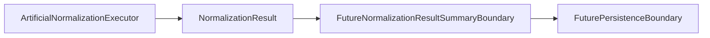

# Normalization Result Summary Boundary

The normalization result summary layer needs a separate boundary because summaries describe output shape and counts; they do not execute normalization or judge record meaning.

## Purpose

A future normalization result summary layer may summarize `NormalizationResult` output for examples, tests, and later handoff boundaries.

That layer should describe execution and output shape. It should not verify carbon accounting correctness, source-owner correctness, or downstream acceptance.

## Current Status

`ArtificialNormalizationExecutor` currently produces deterministic artificial `NormalizedRecord` objects from `ParserNormalizationHandoff` input.

`NormalizationResultSummary` already exists as a lightweight count model on `NormalizationResult`.

`NormalizationResultSummary` now also lives in `src/carbonfactor_parser/normalization/summary.py` as an artificial output-shape contract. It can carry deterministic record and issue counts, optional artificial source labels, and copied metadata without judging record meaning.

No separate normalization result summary builder exists yet.

No integration with `ArtificialNormalizationExecutor` was added for CO-038B.

`examples/example_normalization_result_summary_usage.py` shows direct construction of `NormalizationResultSummary` with artificial deterministic values. It is a model usage example only; it does not add summary builder behavior, executor integration, aggregation semantics, unit conversion, or correctness logic.

Current normalization examples remain artificial, deterministic, local, and in-memory.

## In Scope For Future Implementation

A future summary layer may later summarize:

- Normalized record count.
- Normalization warning count.
- Normalization error count.
- Whether normalized records are present.
- Whether normalization issues are present.
- Whether the result is clean of normalization warnings and errors.
- Artificial source labels or source references already present in contract objects.

Any future implementation should consume already-computed `NormalizationResult` objects. It should not execute parser behavior or normalization behavior.

## Out Of Scope / Non-Goals

The summary layer must remain separate from:

- Parser execution.
- Normalization execution.
- Unit conversion.
- Factor correctness validation.
- Carbon accounting correctness decisions.
- Compliance or legal interpretation.
- Persistence.
- Scheduling and retry behavior.
- Remote source access or downloading.
- Config loading.

## Relationship To Normalization Execution

`ArtificialNormalizationExecutor` is an execution boundary skeleton. It creates artificial `NormalizedRecord` output from artificial handoff input.

A future summary layer should inspect already-produced `NormalizationResult` objects. It should not call parsers, create handoff models, execute normalization, read files, or write storage.

The summary layer should describe the shape and issue counts of the result. It should not change records or convert values.

## Deferred Items

The normalization result summary boundary intentionally defers:

- Summary builder implementation.
- Executor integration.
- Aggregation semantics.
- Unit conversion.
- Factor correctness.
- Carbon accounting correctness.
- Compliance or legal interpretation.
- Real source data.
- File reading.
- Parser behavior change.
- Database or persistence behavior.
- Scheduler behavior.
- Retry or cancel behavior.
- Downloading or remote access.
- Config loading.

## Review Checklist

Future normalization result summary PRs should confirm:

- No summary builder code is added unless explicitly scoped.
- Any directly constructed summary model describes output shape only.
- Usage examples construct the model directly and do not execute normalization.
- No parser behavior is changed.
- No normalization execution behavior is changed.
- No unit conversion is introduced.
- No factor correctness or accounting correctness claims are made.
- No persistence, scheduler, retry, download, remote access, or config loading behavior is introduced.
- No real source data is added unless explicitly scoped.
- The local public safety script passes.
- Tests remain deterministic when code is added.

## Flow Diagram

