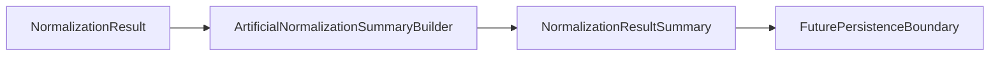

# Normalization Summary Builder Boundary

A future normalization summary builder needs a separate boundary because converting already-computed normalization output into a compact summary is distinct from executing normalization, parsing records, or judging record meaning.

## Purpose

This document defines the future boundary for a normalization summary builder before any builder code is added.

A future builder may later convert `NormalizationResult` output into `NormalizationResultSummary`. That conversion should describe output shape only: counts, issue totals, artificial labels, and metadata already present in provided objects.

This task adds documentation only. It does not add builder implementation code.

## Current Status

`NormalizationResult` represents normalization output records and normalization-level issues.

`NormalizationResultSummary` exists as an artificial output-shape model for deterministic summary values.

`examples/example_normalization_result_summary_usage.py` constructs `NormalizationResultSummary` directly with artificial values. It does not compute a summary from `NormalizationResult`.

`ArtificialNormalizationSummaryBuilder` now exists as a small skeleton that converts an already-computed `NormalizationResult` into `NormalizationResultSummary` with output-shape counts only.

It counts normalized records and normalization issues. It does not perform correctness validation, unit conversion, factor interpretation, persistence, remote access, scheduling, or executor integration.

Current summary examples remain artificial, deterministic, local, and in-memory.

## Future Builder Responsibilities

A future normalization summary builder may later:

- Accept an already-computed `NormalizationResult`.
- Count normalized records.
- Count normalization warnings and errors.
- Populate `NormalizationResultSummary`.
- Preserve artificial source labels or source references already present in contract objects.
- Copy or normalize simple metadata to avoid caller mutation.
- Return deterministic output for examples and tests.

The builder should not execute parser behavior, execute normalization behavior, read files, write storage, or evaluate record meaning.

## Out Of Scope / Non-Goals

The future builder boundary must remain separate from:

- Parser execution.
- Normalization execution.
- Unit conversion.
- Factor correctness validation.
- Carbon accounting correctness decisions.
- Compliance or legal interpretation.
- Real source data handling.
- File reading.
- Persistence.
- Scheduler or retry behavior.
- Remote source access or downloading.
- Config loading.

## Relationship To Normalization Result Summary Model

`NormalizationResultSummary` is the output-shape model. It can be directly constructed with artificial deterministic values.

A future builder would be a separate helper that produces that model from an already-computed `NormalizationResult`. It should not change the model into a reporting engine or add business interpretation.

Direct model construction remains useful for examples and tests where no `NormalizationResult` needs to be inspected.

## Relationship To Normalization Execution

`ArtificialNormalizationExecutor` is an execution boundary skeleton. It accepts parser-to-normalization handoff input and produces artificial `NormalizationResult` output.

A future summary builder should only inspect a `NormalizationResult` after execution has already happened. It should not call `ArtificialNormalizationExecutor`, invoke parsers, create handoff models, normalize values, or change records.

## Deferred Items

The normalization summary builder boundary intentionally defers:

- Executor integration.
- Aggregation semantics beyond simple output-shape counting.
- Unit conversion.
- Factor correctness.
- Carbon accounting correctness.
- Compliance or legal interpretation.
- Real source data.
- File reading.
- Parser behavior change.
- Database or persistence behavior.
- Scheduler behavior.
- Retry or cancel behavior.
- Downloading or remote access.
- Config loading.

## Review Checklist

Future normalization summary builder PRs should confirm:

- The builder consumes already-computed `NormalizationResult` objects only.
- The builder returns `NormalizationResultSummary`.
- Any aggregation remains limited to simple output-shape counts unless explicitly scoped.
- No parser behavior is changed.
- No normalization execution behavior is changed.
- No unit conversion is introduced.
- No factor correctness or accounting correctness claims are made.
- No persistence, scheduler, retry, download, remote access, or config loading behavior is introduced.
- No real source data is added unless explicitly scoped.
- The local public safety script passes.
- Tests remain deterministic when code is added.

## Flow Diagram

