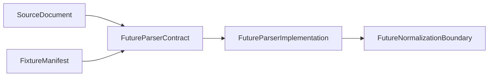

# Parser Contract Boundaries

Parser contract boundaries are documented before code so future parser work starts with explicit scope.

## Purpose

Parser contracts should be added in a later task. This document describes the intended boundary without defining runtime code.

The current source adapter and fixture manifest layers do not parse document contents. They provide source document references, metadata, and local fixture descriptions for future handoff.

`ParserIssue`, `ParserIssueSeverity`, `ParserResultSummary`, and `ParserResult` now provide a minimal source-agnostic parser result contract skeleton. They do not execute parsers or read source files.

See `examples/parser_result_contract_example.py` for an in-memory parser result contract example.

`ExampleInMemoryParser` provides an artificial parser-shaped skeleton that accepts caller-supplied records and returns `ParserResult` without file access.

See `examples/example_in_memory_parser_usage.py` for a small usage example built from artificial in-memory records.

See [Source-Specific Parser Skeleton Boundaries](source-specific-parser-skeleton-boundaries.md) for the boundary before adding source-specific parser skeletons.

`ExampleSourceSpecificParser` provides an artificial source-family-labelled parser skeleton without file parsing or source-specific format assumptions.

See `examples/example_source_specific_parser_usage.py` for a small source-family-labelled parser usage example.

See [DEFRA/DESNZ Parser Skeleton Boundaries](defra-desnz-parser-skeleton-boundaries.md) before adding any DEFRA/DESNZ parser skeleton.

See [Real Format Parser Boundary](real-format-parser-boundary.md) before adding any parser that reads local file contents.

`ParserInputMapping` provides a fixture-only mapping model for already-known `SourceDocument` references before future parser input handoff.

See `examples/parser_input_mapping_example.py` for a small parser input mapping example built from artificial fixture document references.

`ArtificialFixtureParser` demonstrates parser-result creation from fixture mapping metadata without reading local files.

See `examples/example_artificial_fixture_parser_usage.py` for a compact artificial fixture parser usage example.

`ParserPipelineSummary` summarizes already-computed discovery, mapping, and parser result objects without running discovery or parser behavior.

See `examples/parser_pipeline_summary_example.py` for a small fixture-only pipeline summary usage example.

See [Normalization Boundary](normalization-boundary.md) before adding parser-to-normalization handoff contracts or examples.

The normalization package now exposes source-agnostic normalization result contracts for later handoff work, without changing parser contracts.

See [Parser To Normalization Handoff Boundary](parser-to-normalization-handoff-boundary.md) before adding code that maps `ParserResult` into `NormalizationResult`.

## Future Parser Contract Responsibility

A future parser contract may represent:

- Parser input identity.
- A `SourceDocument` reference.
- Source family, source name, or source key metadata.
- Parse status.
- Parsed record placeholders in future code.
- Parser-level warnings or errors.
- Parser summary counts.

Parser contracts should not own persistence, scheduling, downloading, retry behavior, or runtime orchestration.

## Parser Inputs

Conservative input candidates include:

- `SourceDocument`.
- `DefraDesnzFixtureManifestEntry` for local artificial examples.
- Source metadata such as source family, source name, or source key.
- Local path reference when available.
- Discovery warnings or errors as contextual metadata.

Discovery warnings or errors should not be treated as parsed records.

## Parser Outputs

Conservative output candidates include:

- A parse result object.
- Parsed rows or records in future tasks.
- Parser validation issues.
- Parser warnings or errors.
- Summary counts.

Parser outputs should not represent normalized, certified, or correctness results.

## Non-Goals

Parser contracts should not define:

- Normalization.
- Database writes.
- Scheduler or retry logic.
- Source downloading.
- Source-owner data validation.
- Compliance or legal interpretation.
- Carbon accounting correctness determination.

## Boundary Table

| Layer | Responsibility | Out of scope |
| --- | --- | --- |
| Source adapter | Discover `SourceDocument` references | Parser contracts and file content parsing |
| Fixture manifest | Describe discovered local fixture documents | Parser output or schema inference |
| Parser contract | Future data shape for parser input and output handoff | Parser implementation |
| Parser implementation | Future file reading and parse logic | Normalization, persistence, scheduling |
| Normalization | Future explicit transformations | Source discovery and parsing |
| Persistence | Future storage writes | Parser execution and scheduler behavior |
| Scheduler/runtime orchestration | Future timed or operational execution | Parser contracts and source interpretation |

## Recommended Implementation Sequence

Future parser work should proceed conservatively:

1. Parser contract model skeleton.
2. Artificial parser result tests.
3. Fixture parser example.
4. Source-specific parser skeleton.
5. Real format parsing only after explicit scope.

Each step should remain separate from normalization, persistence, scheduling, downloading, and runtime orchestration.

## Review Checklist

Future parser contract PRs should confirm:

- No real source data is added.
- No format assumptions are added unless explicitly scoped.
- No normalization is introduced.
- No persistence behavior is introduced.
- No compliance or correctness claims are made.
- Tests are deterministic.
- The contract remains source-agnostic unless the task explicitly says otherwise.

## Flow Diagram

