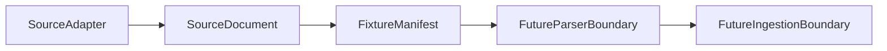

# Parser Handoff Boundary

Source adapters and fixture manifests describe candidate documents for later work. Parser execution is a future separate boundary.

## Purpose

This boundary exists to keep source discovery separate from parser behavior.

Source adapters discover and describe `SourceDocument` references. Fixture manifests summarize already-discovered local fixture documents. Neither layer should imply that file contents have been parsed, interpreted, normalized, or prepared for persistence.

Parser execution may be added later as its own documented and testable boundary.

See [Parser Contract Boundaries](parser-contract-boundaries.md) for the intended scope of future parser contract code.

The current parser contract skeleton describes parser result handoff data only; it does not execute parser logic.

See `examples/parser_result_contract_example.py` for a source-agnostic in-memory result example.

`ExampleInMemoryParser` demonstrates parser implementation shape without reading files or interpreting source-specific formats.

See `examples/example_in_memory_parser_usage.py` for a deterministic in-memory parser usage example.

See [Source-Specific Parser Skeleton Boundaries](source-specific-parser-skeleton-boundaries.md) before adding source-specific parser skeletons.

See [Real Format Parser Boundary](real-format-parser-boundary.md) before adding any parser that reads local file contents.

## Inputs To A Future Parser Boundary

Conservative handoff inputs may include:

- `SourceDocument` references.
- Source family, source name, or source key metadata when available.
- Fixture manifest entries for local artificial examples.
- Discovery warnings or errors where relevant.
- Content hash or retrieval metadata when already available on `SourceDocument`.

These inputs describe candidate documents only. They do not mean the document contents have been parsed.

## Adapter And Manifest Non-Responsibilities

Source adapters and fixture manifests must not perform:

- File content parsing.
- Schema inference.
- Factor value interpretation.
- Unit conversion.
- Normalization.
- Persistence.
- Scheduler or retry behavior.
- Compliance or correctness determination.

## Future Parser Boundary

A future parser boundary may later:

- Read file contents.
- Identify file format.
- Produce parse records or validation issues.
- Report parser-level warnings or errors.
- Preserve source traceability from `SourceDocument` to parser output.

That boundary should remain separate from persistence, scheduling, retry behavior, downloading, and runtime orchestration.

## DEFRA/DESNZ Current Status

`DefraDesnzSourceAdapter` is local fixture discovery only.

`DefraDesnzFixtureManifest` is artificial fixture metadata only.

No real DEFRA/DESNZ parsing exists yet. The current repository fixtures do not include source-owner data or real factor values.

## Boundary Table

| Layer | Current role | Out of scope here |
| --- | --- | --- |
| Source adapter | Discover candidate `SourceDocument` references | Parsing, normalization, persistence, scheduling |
| Fixture manifest | Describe already-discovered local fixture documents | Reading file contents or inferring schema |
| Future parser | Future boundary for reading files and producing parse records or issues | Persistence and runtime orchestration |
| Future normalization | Future boundary for explicit value transformations | Source discovery and parser execution |
| Future persistence | Future boundary for storage writes | Discovery, parsing, and scheduling |
| Future scheduler | Future boundary for timed execution | Source document interpretation |

## Future Task Sequencing

Conservative sequencing should be:

1. Parser contract documentation.
2. Artificial parser contract model.
3. Fixture parser example.
4. Source-specific parser skeleton.
5. Real source parsing only after explicit scope.

Each step should stay small, reviewable, and separate from persistence, scheduling, downloading, and runtime orchestration.

## Flow Diagram

