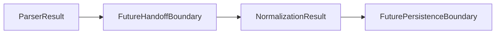

# Parser To Normalization Handoff Boundary

Parser-to-normalization handoff needs a separate boundary because `ParserResult` is not `NormalizationResult`.

## Purpose

`ParserResult` is parser output. It describes parser records, parser issues, parser summary counts, and source document context when available.

`NormalizationResult` is a future normalization output shape. It should be produced only by later explicitly scoped handoff or normalization work.

No parser-to-normalization handoff implementation exists yet.

`ParserNormalizationHandoff`, `ParserNormalizationHandoffEntry`, and `build_parser_normalization_handoff()` now provide a minimal source-agnostic handoff model for already-computed parser result metadata. They do not execute normalization or convert values.

`ParserExecutionNormalizationHandoff`, `ParserExecutionNormalizationHandoffResult`, and `build_parser_execution_normalization_handoff()` provide the newer handoff boundary from `ParserExecutionResult`. They create ready handoffs only for successful parser execution results and pass through raw parsed record payloads when a successful parser result already carries them.

See `examples/parser_normalization_handoff_example.py` for an in-memory parser-to-normalization handoff usage example.

See [Normalization Execution Boundary](normalization-execution-boundary.md) before adding executor code that produces `NormalizationResult`.

## What ParserResult Provides

`ParserResult` may provide:

- Parser records.
- Parser issues.
- Parser summary counts.
- Source document context when present.

`ParserResult` has no normalized, certified, or correctness meaning. Parser records should not be treated as normalized records by default.

## Future Normalization Input

Future normalization input may later receive:

- Parser records.
- Raw parser record payloads from successful parser execution results.
- Parser issue context.
- Source document reference or context.
- Optional artificial source labels.

These inputs do not imply that parsed values are correct, complete, normalized, or ready for storage.

## Default Handoff Non-Responsibilities

Parser-to-normalization handoff must not do by default:

- Unit conversion.
- Factor correctness validation.
- Carbon accounting correctness decisions.
- Database writes.
- Scheduler or retry behavior.
- Source downloading.
- Legal or compliance interpretation.
- Automatic acceptance of parser output as normalized output.

## Responsibility Table

| Layer | Responsibility | Out of scope |
| --- | --- | --- |
| Parser | Produce `ParserResult` records, issues, and summary counts | Normalized records and unit conversion |
| Parser-to-normalization handoff | Future explicit mapping boundary between parser output and normalization input | Correctness decisions, persistence, scheduling |
| Normalization | Future production of `NormalizationResult` records and normalization issues | Parser execution, source downloading, runtime orchestration |
| Validation | Future checks for handoff or normalized record shape | Source-owner validation or compliance interpretation |
| Persistence | Future storage writes behind a separate boundary | Parser and normalization behavior |
| Scheduler/runtime | Future timed or operational execution | Handoff semantics and record interpretation |
| Compliance/legal interpretation | Outside this package boundary | Parser, handoff, normalization, validation, and persistence behavior |

## DEFRA/DESNZ Implications

`DefraDesnzParser` is currently artificial and in-memory only.

No real DEFRA/DESNZ normalization handoff exists.

No real factor values are normalized in the current repository.

Future DEFRA/DESNZ handoff requires separate explicit scope and should remain separate from parser execution, normalization execution, persistence, scheduler, and remote source work.

## Review Checklist

Future handoff PRs should confirm:

- No unit conversion is added unless explicitly scoped.
- No correctness or compliance claims are made.
- No persistence coupling is introduced.
- No scheduler coupling is introduced.
- No real source data is added unless explicitly scoped.
- The local public safety script passes.
- Tests remain deterministic when code is added.

## Future Task Sequencing

Conservative sequencing should be:

1. Parser-to-normalization handoff boundary documentation.
2. Artificial handoff contract or model skeleton.
3. Artificial handoff usage example.
4. Normalization execution boundary documentation.
5. Persistence boundary documentation.
6. Real parser-to-normalization mapping only after explicit scope.

Each step should remain small, local, and separately reviewable.

## Flow Diagram

