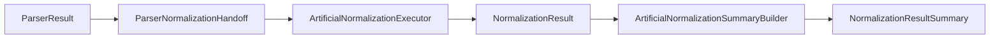

# Parser To Normalization Integration Recap

This recap explains how parser output and parser handoff artifacts connect to the current artificial normalization pipeline.

## Purpose

Parser output and normalization execution are separate boundaries. Parser contracts describe parsed records and parser-level issues. Normalization contracts describe normalized records and normalization-level issues.

This document summarizes the handoff between those boundaries. It adds no code, contracts, examples, tests, or runtime behavior.

## Current Integration Artifacts

The current integration path uses:

- `ParserResult`: parser output with generic records and parser issues.
- `ParserNormalizationHandoff`: handoff metadata prepared from parser output for the normalization boundary.
- `ParserNormalizationHandoffEntry`: one parser record prepared for normalization input.
- `build_parser_normalization_handoff()`: helper that creates handoff metadata from an existing parser result.
- `ArtificialNormalizationExecutor`: artificial skeleton that consumes handoff entries and creates normalization output.
- `NormalizationResult`: normalization output containing records and issues.
- `NormalizedRecord`: one generic normalized record shape.
- `NormalizationResultSummary`: output-shape summary model.
- `ArtificialNormalizationSummaryBuilder`: artificial skeleton that counts records and issues from an existing normalization result.

These artifacts are artificial, deterministic, local, and in-memory.

## Boundary Flow

Parser records move toward normalization through handoff metadata rather than direct parser execution inside normalization.

The handoff boundary preserves parser record data and context. It does not validate factor meaning, convert units, or decide whether parser values are correct.

The artificial normalization executor consumes handoff entries and returns `NormalizationResult`. It does not run parsers, read files, download sources, persist records, schedule work, or perform retry behavior.

Summary artifacts sit after normalization output. `NormalizationResultSummary` describes output shape, and `ArtificialNormalizationSummaryBuilder` derives that model from an existing `NormalizationResult` by counting records and issues only.

## What Is Intentionally Separated

The current design keeps these responsibilities separate:

- Parser execution remains outside normalization.
- Parser handoff describes already-computed parser output.
- Artificial normalization execution creates deterministic artificial normalized records.
- Summary models describe output shape only.
- Summary builders count output shape only.
- Persistence and scheduling remain outside this package boundary.
- Real source access and file reading remain outside this artificial flow.

## Current Artificial Flow

At a high level:

1. A parser produces `ParserResult`.
2. `build_parser_normalization_handoff()` creates `ParserNormalizationHandoff`.
3. `ArtificialNormalizationExecutor` accepts the handoff and creates artificial `NormalizedRecord` entries.
4. The executor returns `NormalizationResult`.
5. `ArtificialNormalizationSummaryBuilder` counts records and issues from `NormalizationResult`.
6. The builder returns `NormalizationResultSummary`.

This flow documents contract shape and boundary sequencing only.

## Non-Goals

This recap does not introduce:

- Real parser-to-normalization integration behavior.
- Real normalization correctness.
- Unit conversion.
- Factor correctness validation.
- Carbon accounting correctness decisions.
- Compliance or legal interpretation.
- Real source data handling.
- File reading.
- Parser behavior changes.
- Database or persistence behavior.
- Scheduler or retry behavior.
- Remote source access or downloading.
- Config loading.

## Deferred Items

The parser-to-normalization integration recap intentionally defers:

- Real parser-to-normalization integration behavior.
- Real normalization correctness.
- Executor integration beyond current artificial skeleton behavior.
- Aggregation semantics beyond output-shape counting.
- Unit conversion.
- Factor correctness.
- Carbon accounting correctness.
- Compliance or legal interpretation.
- Real source data.
- File reading.
- Parser behavior change.
- Database or persistence behavior.
- Scheduler behavior.
- Retry or cancel behavior.
- Downloading or remote access.
- Config loading.

## Review Checklist

Future parser-to-normalization integration PRs should confirm:

- Parser behavior is not changed unless explicitly scoped.
- Handoff models remain a boundary between parser output and normalization input.
- Normalization execution remains separate from parser execution.
- Artificial examples remain deterministic and in-memory unless a later task scopes otherwise.
- Summary behavior remains limited to output-shape counting unless explicitly scoped.
- No real source data is added unless explicitly scoped.
- No persistence, scheduler, retry, download, remote access, or config loading behavior is introduced.
- The local public safety script passes.

## Related Documents

- [Parser Handoff Boundary](parser-handoff-boundary.md)
- [Parser Contract Boundaries](parser-contract-boundaries.md)
- [Parser To Normalization Handoff Boundary](parser-to-normalization-handoff-boundary.md)
- [Normalization Boundary](normalization-boundary.md)
- [Normalization Execution Boundary](normalization-execution-boundary.md)
- [Normalization Pipeline Recap](normalization-pipeline-recap.md)
- [Normalization Deferred Implementation Roadmap](normalization-deferred-implementation-roadmap.md)

## Flow Diagram

