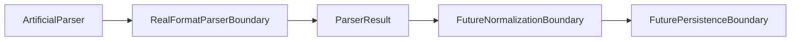

# Real Format Parser Boundary

Real-format parser work needs an explicit boundary because it is the first place future code may inspect local file contents.

## Purpose

Current parser work is artificial and in-memory only.

No real file parsing is implemented yet. Existing parser contracts and skeletons return `ParserResult` from caller-supplied records without opening source files.

## What Real-Format Parser Work Means Later

Future real-format parser work may include:

- Reading a known local fixture file only when explicitly scoped.
- Identifying a file structure.
- Mapping rows, cells, or fields into parser records.
- Producing `ParserResult`.
- Producing `ParserIssue` warnings or errors.
- Remaining separate from normalization, persistence, scheduling, and compliance interpretation.

## Default Non-Responsibilities

Real-format parser work must not include by default:

- Downloading.
- Remote access.
- Credentials or sensitive access handling.
- Persistence.
- Normalization.
- Source-owner data validation.
- Carbon accounting correctness determination.
- Legal or compliance interpretation.
- Scheduler or retry behavior.

## Real Source Data Policy

Real source files must not be committed unless a later task explicitly allows it and licensing plus public-use safety have been reviewed.

Artificial fixtures remain the default.

Copied source-owner tables or real factor values should be avoided unless a later task explicitly scopes that work.

The local public safety validation script must pass before review.

`ParserInputMapping` and `ParserInputMappingEntry` provide a fixture-only model for preparing already-known `SourceDocument` references before any future parser reads local fixture contents.

See `examples/parser_input_mapping_example.py` for a deterministic fixture-only mapping example.

`ArtificialFixtureParser` consumes `ParserInputMapping` and produces artificial `ParserResult` records from mapping metadata only.

See `examples/example_artificial_fixture_parser_usage.py` for a deterministic usage example.

## DEFRA/DESNZ Implications

`DefraDesnzParser` is currently artificial and in-memory only.

Real DEFRA/DESNZ parsing requires separate explicit scope. Real format assumptions must not be introduced casually.

Parser output remains `ParserResult`; it is not a normalized or certified result.

## Boundary Table

| Layer | Responsibility | Out of scope |
| --- | --- | --- |
| Artificial parser skeleton | Demonstrate parser shape with caller-supplied records | Reading files or source-specific format logic |
| Real-format parser | Future local fixture reading and record mapping when explicitly scoped | Downloading, normalization, persistence, scheduling |
| Normalization | Future explicit transformations | File discovery and parser record extraction |
| Persistence | Future storage writes | Parser execution and format interpretation |
| Scheduler/runtime | Future timed or operational execution | Parser behavior and source interpretation |
| Compliance/legal interpretation | Outside this repository boundary | Parser output, validation, and runtime behavior |

## Review Checklist

Future real-format parser PRs should confirm:

- No real URLs are added unless explicitly scoped.
- No real files are added unless explicitly scoped.
- No real factor values are added unless explicitly scoped.
- Parser reads only allowed local fixture files when file reading is scoped.
- Output remains `ParserResult`.
- No normalization, persistence, or scheduler coupling is introduced.
- The local public safety script passes.
- Tests are deterministic.

## Future Task Sequencing

Conservative sequencing should be:

1. Real format boundary documentation.
2. Fixture-only parser input mapping model.
3. Artificial fixture parser implementation.
4. Source-specific real fixture parser implementation.
5. Normalization boundary documentation.
6. Persistence boundary documentation.

Each step should remain small, local, and separately reviewable.

## Flow Diagram

