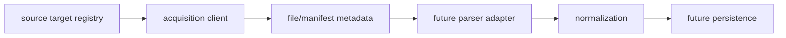

# Source Acquisition Parser Handoff Contract

This document defines the current contract between source acquisition output and future source-specific parser input.

It is a boundary document only. It does not add parser execution, database writes, normalization execution, scheduler behavior, retry/cancel behavior, new credentials handling, or source acquisition behavior beyond the current explicit HTTP client boundary.

## Purpose

Source acquisition now has package-level concepts for target descriptors, acquisition clients, local file metadata, manifests, run summaries, status values, and the CLI boundary. Future source-specific parsers will need a stable input shape from that layer without making acquisition responsible for parsing or making parsers responsible for downloading.

This contract records what source acquisition may hand forward and what downstream parser and normalization work must continue to treat as deferred implementation.

## Boundary Definitions

| Boundary | Current responsibility | Explicitly out of scope here |
| --- | --- | --- |
| Source target registry | Defines known source acquisition descriptors, including source family, source id, display name, acquisition location metadata, and expected format hints. | Parser selection, parser execution, normalization, persistence, scheduling, retry policy, or source correctness claims. |
| Source acquisition | Plans or runs acquisition through the current client boundary. No-op mode remains offline; HTTP mode remains explicit and opt-in. | Source-specific parsing, database writes, normalization execution, scheduler/background job behavior, retry/cancel behavior, credentials, or network expansion beyond the current HTTP client boundary. |
| Source document/file metadata | Describes acquired or known local artifact metadata such as local path, checksum, content type, content length, and status when available. | Reading file contents for parser logic, inferring schemas, validating factor values, normalizing values, or proving source-owner correctness. |
| Manifest/run status | Records deterministic metadata about acquisition results and run-level summaries where currently scoped. | Durable persistence, audit storage guarantees, scheduler state, retry history, cancellation state, or import lifecycle ownership. |
| Future source-specific parser input | May receive explicit acquisition metadata as input for a later parser adapter task. | Hidden acquisition, live downloading, DB writes, normalization, scheduler behavior, or accepting an artifact as parsed. |
| Normalization handoff | Remains downstream of parser output and must be explicitly scoped by future parser-to-normalization work. | Direct use of acquisition metadata as normalized records, unit conversion, factor correctness decisions, persistence, or compliance/legal interpretation. |

## Data That May Be Passed Forward

A future parser adapter may receive only explicit acquisition output fields and derived metadata that are already present in the current boundaries. Conservative handoff data may include:

- Source family.
- Source id.
- Local file path when content was persisted locally.
- Acquired artifact reference when represented by a current manifest entry or run result.
- Checksum or hash metadata where available, such as SHA-256.
- Content type or format hint where available.
- Content length where available.
- Acquisition status, such as acquired, failed, skipped, or not implemented.
- Acquisition message or warning text when present.
- Run metadata and manifest metadata where currently recorded.
- Descriptor metadata needed to route to a future source-specific parser adapter.

These values describe acquisition output only. They do not mean the artifact has been parsed, validated for factor correctness, normalized, or prepared for database persistence.

## Parser Adapter Expectations

A future parser adapter should treat acquisition output as an explicit input contract:

- It should receive source identity instead of rediscovering it.
- It should receive a local path or artifact reference instead of downloading content.
- It should preserve checksum and content metadata for traceability where available.
- It should report parser-level issues separately from acquisition status.
- It should produce parser output through a separately scoped parser contract.

Parser adapters should not infer hidden retry behavior, hidden source lookups, implicit credential access, scheduler state, or persistence behavior from acquisition metadata.

## Example Mapping

`ParserInputContract` and `create_parser_input_contract()` provide the small public parser input boundary for source acquisition output prepared for future parser execution. The contract preserves source identity, artifact reference, checksum metadata, content type or format hints, acquisition status, and run or manifest metadata without carrying parser output, normalization output, or database persistence fields.

`validate_parser_input_contract()` provides shape validation for this boundary. It checks required identity, artifact reference, acquisition status, and optional metadata presence rules without reading files, making network calls, executing a parser, executing normalization, or writing to a database.

See `examples/example_acquisition_artifact_parser_input_mapping.py` for an in-memory, deterministic example that maps source acquisition artifact metadata into `ParserInputContract`. The example preserves source identity, artifact reference, checksum metadata, content type/format hint, acquisition status, and run/manifest metadata without reading files, making network calls, executing a parser, executing normalization, or writing to a database.

## Normalization Handoff Expectations

Normalization remains downstream of parser output. Acquisition metadata may travel with parser output as source context, but it is not normalization input by itself.

Future parser-to-normalization work may preserve:

- Source family and source id for traceability.
- Artifact path or reference for source context.
- Checksum and format metadata for reproducibility notes.
- Parser result identifiers and parser issues.
- Run or manifest context when explicitly mapped.

That future handoff must remain separate from normalization execution, database persistence, scheduler behavior, unit conversion, and factor correctness decisions.

## Current Flow

The diagram names future downstream boundaries to show expected sequencing. It does not imply those downstream execution steps are implemented by this task.

## What Must Not Happen In This Task

This task must not add:

- Real parser execution.
- Database writes.
- Normalization execution.
- Scheduler behavior.
- Retry behavior.
- Cancel behavior.
- Background job behavior.
- Credential or secret handling.
- New source download behavior.
- Network expansion beyond the current explicit HTTP client boundary.
- Source-specific ingestion beyond the existing source acquisition descriptor and client boundaries.
- Parser, database, scheduler, downloader, or normalization coupling.
- Public claims about production readiness, source correctness, compliance, legal interpretation, or carbon accounting correctness.

## Future Implementation Gates

Future implementation tasks should stay deferred and independently reviewable:

- Define a parser adapter input model only when parser adapter code is explicitly scoped.
- Add source-specific parser execution only when that source parser task is explicitly scoped.
- Add parser-to-normalization mapping only through the existing normalization handoff boundaries.
- Add persistence only through a separate database task.
- Add scheduler, retry, or cancel behavior only through separate runtime/orchestration tasks.
- Add additional remote acquisition behavior only through explicit source acquisition tasks.

## Review Checklist

Reviewers should confirm:

- The change is documentation-first and does not implement parser execution.
- The handoff data is limited to explicit acquisition metadata.
- The document does not make acquisition responsible for parsing, normalization, persistence, or scheduling.
- Future parser adapter work remains deferred.
- Future normalization and persistence work remain deferred.
- Public safety wording is preserved.

## Related Documents

- [Source Acquisition Boundary](source-acquisition-boundary.md)
- [Source Acquisition Manifest Boundary](source-acquisition-manifest-boundary.md)
- [Source Acquisition Run Boundary](source-acquisition-run-boundary.md)
- [Source Acquisition HTTP Client Boundary](source-acquisition-http-client-boundary.md)
- [Source Acquisition Registry](source-acquisition-registry.md)
- [Parser Handoff Boundary](parser-handoff-boundary.md)
- [Parser Contract Boundaries](parser-contract-boundaries.md)
- [Parser To Normalization Handoff Boundary](parser-to-normalization-handoff-boundary.md)
- [Normalization Boundary](normalization-boundary.md)
- [Public Safety](public-safety.md)
