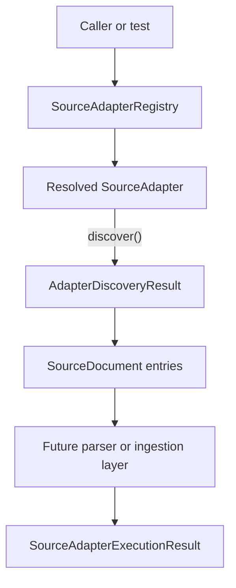

# Source Adapter Execution Flow

Source adapters provide a small boundary for resolving a source family and discovering source document references. They describe source documents for later handoff; they do not parse factor records, normalize source values, persist data, schedule work, or validate emissions correctness.

## Purpose

This document explains the intended flow from adapter registry resolution to discovered `SourceDocument` handoff.

The current package supports lightweight composition and local discovery examples. It does not implement source-specific ingestion for GHG Protocol, DEFRA / DESNZ, or IPCC EFDB.

## Execution Flow

The intended flow is:

1. Create or receive a `SourceAdapterRegistry`.
2. Register available adapters explicitly.
3. Resolve an adapter by `SourceFamily` or a project-level source key that maps to `SourceFamily`.
4. Call `discover()` on the resolved adapter.
5. Receive an `AdapterDiscoveryResult`.
6. Inspect discovered `SourceDocument` entries and discovery warnings.
7. Hand discovered documents to future parser or ingestion steps.
8. When a later execution layer parses a document, represent that parse handoff with `SourceAdapterExecutionResult`.

The current adapter contract exposes `discover()` and `parse(document)`. `SourceAdapterExecutionResult` is a passive result contract for later execution slices; it is not produced by `SourceAdapterRegistry` or by `discover()`.

See [Source Adapter Error And Warning Handling](source-adapter-error-warning-handling.md) for guidance on discovery warnings and execution handoff errors.

## Component Responsibilities

| Component | Responsibility |
| --- | --- |
| `SourceAdapterRegistry` | Holds explicitly registered adapters and resolves them by `SourceFamily` |
| `SourceAdapter` | Defines the adapter boundary for discovery and parse handoff methods |
| `SourceDocument` | Carries source family, source name, file reference or URL, version/date, retrieval timestamp, and content hash when available |
| `SourceAdapterExecutionResult` | Represents a later parse execution handoff by tying one source document to parse output and ingestion summary metadata |
| Parser or ingestion layer | Future/deferred layer that may parse, validate, normalize, persist, schedule, or orchestrate source processing outside the adapter package |

## Boundaries And Non-Goals

The adapter skeleton layer does not own:

- Source-specific ingestion.
- Database writes.
- Scheduler behavior.
- Parser coupling.
- Retry or cancellation orchestration.
- Download behavior.
- Source or emissions result correctness claims.

Adapters should remain small and source-aware. Shared validation, normalization, metadata, persistence, and scheduling concerns belong behind separate boundaries.

## Example Reference

See [examples/source_adapter_registry_example.py](../examples/source_adapter_registry_example.py) for a local-only example that:

- Creates a `SourceAdapterRegistry`.
- Registers `NoOpSourceAdapter`.
- Registers `LocalFileSourceAdapter`.
- Resolves adapters by `SourceFamily`.
- Calls `discover()` through the resolved adapter.

See [examples/local_source_fixture_discovery_example.py](../examples/local_source_fixture_discovery_example.py) for a deterministic fixture discovery example using artificial local files.

## Future Extension Points

Future tasks may add:

- Source-specific adapters after source structure review.
- Recursive discovery only when explicitly configured.
- Content hashing enrichment where needed for traceability or idempotency.
- Persistence integration behind a separate ingestion boundary.
- Scheduled execution outside the adapter package.

Each extension should preserve source traceability and avoid hiding source-family-specific behavior inside shared registry or helper code.
