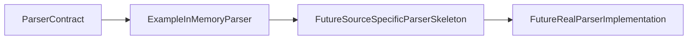

# Source-Specific Parser Skeleton Boundaries

Source-specific parser skeletons should be introduced only after parser contracts and source discovery boundaries are clear.

## Purpose

This document defines the boundary for future source-specific parser skeletons before any source-specific parser implementation is added.

A source-specific parser skeleton may name a source family and demonstrate parser wiring, but it should not introduce real parsing behavior unless a later task explicitly scopes that work.

## What A Skeleton May Do Later

A future source-specific parser skeleton may:

- Accept source-agnostic parser inputs or pre-supplied artificial records.
- Return `ParserResult`.
- Attach `ParserIssue` warnings or errors.
- Document source-family identity.
- Remain deterministic in tests.
- Use artificial fixtures only until real parsing is explicitly scoped.

## Default Non-Responsibilities

A source-specific parser skeleton must not add by default:

- Real file parsing.
- Real DEFRA/DESNZ format assumptions.
- Real factor values.
- Source-owner data validation.
- Normalization.
- Persistence.
- Scheduler or retry behavior.
- Downloading or remote access.
- Compliance, legal, or correctness determination.

## Difference From ExampleInMemoryParser

`ExampleInMemoryParser` is source-agnostic and artificial. It accepts caller-supplied records and returns `ParserResult` without reading files or interpreting source-specific formats.

A future source-specific parser skeleton may introduce source-family naming, but it should still avoid real format logic unless that behavior is explicitly scoped in a later task.

`ExampleSourceSpecificParser` is the current artificial source-specific parser skeleton. It labels parser output with caller-provided source-family metadata and accepts only caller-supplied artificial records.

See `examples/example_source_specific_parser_usage.py` for a deterministic usage example built from caller-supplied artificial records.

See [DEFRA/DESNZ Parser Skeleton Boundaries](defra-desnz-parser-skeleton-boundaries.md) before adding any DEFRA/DESNZ parser skeleton.

## DEFRA/DESNZ Parser Status

No DEFRA/DESNZ parser exists yet.

Current DEFRA/DESNZ work is limited to local fixture discovery and artificial fixture manifest metadata. Real parsing requires separate explicit tasks.

## Review Checklist

Future source-specific parser skeleton PRs should confirm:

- No file reads are added unless explicitly scoped.
- No real source data is added.
- No format assumptions are added.
- No normalization or persistence behavior is introduced.
- The local public safety script passes.
- Tests are deterministic.
- Parser output remains `ParserResult`.

## Future Task Sequencing

Conservative sequencing should be:

1. Artificial source-specific parser skeleton.
2. Source-specific parser usage example.
3. Fixture-only parser input model.
4. Real format parser boundary documentation.
5. Real parser implementation only after explicit scope.

Each step should stay separate from downloading, persistence, scheduling, retry behavior, and runtime orchestration.

## Flow Diagram

