# Source To Normalization Pipeline Recap

This recap explains the current high-level path from source adapter discovery through parser handoff and artificial normalization output.

## Purpose

The repository now has source adapter contracts, parser contracts, parser-to-normalization handoff artifacts, and an artificial normalization track.

This document connects those boundaries at a high level. It adds no code, contracts, examples, tests, or runtime behavior.

## Current Pipeline Artifacts

The current pipeline includes:

- Source adapter contracts and examples that discover or describe candidate source documents.
- `SourceDocument` and source adapter result concepts that carry source metadata and discovery results.
- Parser input mapping artifacts that prepare fixture document references for parser boundaries.
- Parser contracts that produce `ParserResult` with generic parser records and parser-level issues.
- `ParserNormalizationHandoff` and `ParserNormalizationHandoffEntry` as the parser-to-normalization handoff boundary.
- `ArtificialNormalizationExecutor` as an artificial normalization execution skeleton.
- `NormalizationResult` and `NormalizedRecord` as normalization output contracts.
- `NormalizationResultSummary` as an output-shape summary model.
- `ArtificialNormalizationSummaryBuilder` as an artificial output-shape counting skeleton.

Current examples are artificial, deterministic, and in-memory unless an existing local fixture example explicitly documents local fixture discovery.

## Boundary Flow

The source adapter boundary discovers or describes candidate source documents. It does not parse document contents, normalize records, persist data, or schedule work.

The parser boundary consumes prepared parser input and returns parser records. Parser output remains separate from normalization execution.

The parser-to-normalization handoff boundary packages already-computed parser records for normalization input. It does not decide whether parser values are correct.

The artificial normalization boundary accepts handoff data and creates deterministic artificial `NormalizedRecord` entries.

The summary boundary describes normalization output shape through counts and metadata. It does not report correctness or acceptance.

## Current Artificial Flow

At a high level:

1. A source adapter discovers or describes source document references.
2. Parser input mapping prepares fixture or artificial source references for parser-facing examples.
3. Parser contracts produce `ParserResult`.
4. `build_parser_normalization_handoff()` creates `ParserNormalizationHandoff`.
5. `ArtificialNormalizationExecutor` creates artificial `NormalizedRecord` entries.
6. The executor returns `NormalizationResult`.
7. `ArtificialNormalizationSummaryBuilder` counts records and issues from `NormalizationResult`.
8. The builder returns `NormalizationResultSummary`.

This flow documents boundary sequencing only.

## What Is Intentionally Separated

The current design keeps these responsibilities separate:

- Source discovery remains separate from parsing.
- Parser execution remains separate from normalization.
- Parser-to-normalization handoff remains separate from normalization execution.
- Artificial normalization output remains separate from summary counting.
- Summary counting remains separate from persistence and reporting.
- Persistence, scheduling, retry behavior, remote access, and config loading remain outside this flow.

## Non-Goals

This recap does not claim:

- Source coverage.
- Parser correctness.
- Normalization correctness.
- Factor correctness.
- Unit conversion correctness.
- Carbon accounting correctness.
- Compliance or legal interpretation.
- Production readiness.
- External data coverage.

It documents boundaries only and adds no behavior.

## Deferred Items

The source-to-normalization pipeline recap intentionally defers:

- Real source acquisition.
- Real parser-to-normalization integration behavior.
- Real normalization correctness.
- Executor integration beyond current artificial skeleton behavior.
- Aggregation semantics beyond output-shape counting.
- Unit conversion.
- Factor correctness.
- Carbon accounting correctness.
- Compliance or legal interpretation.
- Real source data.
- File reading beyond existing local and artificial examples.
- Source adapter behavior change.
- Parser behavior change.
- Database or persistence behavior.
- Scheduler behavior.
- Retry or cancel behavior.
- Downloading or remote access.
- Config loading.

## Review Checklist

Future source-to-normalization pipeline PRs should confirm:

- Source adapter behavior is not changed unless explicitly scoped.
- Parser behavior is not changed unless explicitly scoped.
- Normalization behavior is not changed unless explicitly scoped.
- Artificial examples remain deterministic and in-memory unless a later task scopes otherwise.
- Local fixture examples remain local and documented.
- No real source data is added unless explicitly scoped.
- No persistence, scheduler, retry, download, remote access, or config loading behavior is introduced.
- The local public safety script passes.

## Related Documents

- [Source Adapter Execution Flow](source-adapter-execution-flow.md)
- [Source Adapter Package Recap](source-adapter-package-recap.md)
- [Parser Handoff Boundary](parser-handoff-boundary.md)
- [Parser Contract Boundaries](parser-contract-boundaries.md)
- [Real Format Parser Boundary](real-format-parser-boundary.md)
- [Parser To Normalization Handoff Boundary](parser-to-normalization-handoff-boundary.md)
- [Parser To Normalization Integration Recap](parser-to-normalization-integration-recap.md)
- [Normalization Pipeline Recap](normalization-pipeline-recap.md)
- [Normalization Deferred Implementation Roadmap](normalization-deferred-implementation-roadmap.md)

## Flow Diagram

```mermaid
flowchart LR
    adapter["SourceAdapter"]
    document["SourceDocument"]
    parser["ParserResult"]
    handoff["ParserNormalizationHandoff"]
    executor["ArtificialNormalizationExecutor"]
    result["NormalizationResult"]
    summary_builder["ArtificialNormalizationSummaryBuilder"]
    summary["NormalizationResultSummary"]

    adapter --> document
    document --> parser
    parser --> handoff
    handoff --> executor
    executor --> result
    result --> summary_builder
    summary_builder --> summary
```

